# 3 Requirement and Analysis (Ref Project)

This document covers **Requirement and Analysis (3.1–3.5)** and **Conceptual Diagrams (3.6)** for the `ref/` handwriting synthesis system.

Diagrams are written in **PlantUML** so they can be rendered directly in VS Code (PlantUML extension) or any PlantUML renderer.

---

## 3.1 Problem Definition

### 3.1.1 Problem Analysis

The goal is to build a system that converts **input text** into **human-like handwriting** by generating a continuous sequence of pen strokes. The key challenges are:

- **Sequence generation:** handwriting is a long, variable-length time series with dependencies across timesteps.
- **Continuous outputs:** pen motion is continuous (x/y) plus a discrete pen-up/pen-down state.
- **Alignment:** text characters must be aligned to stroke segments (often unknown a priori), requiring attention-like mechanisms.
- **Style variability:** handwriting style differs per writer and even within the same writer; controlling style and “neatness” matters.
- **Rendering:** generated offsets must be converted into readable SVG/graphics.

In this `ref/` implementation, these challenges are addressed with:

- **RNN-based model** with LSTM layers and an attention window over characters.
- **Mixture Density Network (MDN / GMM head)** to model continuous coordinates.
- **Style priming** via pre-saved style samples (`styles/style-*-strokes.npy`, `styles/style-*-chars.npy`).
- **Bias parameter** to control output neatness/diversity.

### 3.1.2 Existing Problem

Traditional approaches (fonts / rule-based stroke synthesis) often produce:

- Unnatural strokes and spacing,
- Lack of personalization,
- Limited variability and poor realism.

### 3.1.3 Proposed System

The proposed system is a stroke-based handwriting generator:

1. **Input:** text lines (ASCII) + optional (style, bias)
2. **Encoding:** convert text to integer IDs (`drawing.encode_ascii`)
3. **Generation:** RNN + attention + MDN predicts stroke offsets and pen state
4. **Post-process:** denoise + align + convert offsets → coordinates
5. **Render:** export SVG via `svgwrite`

---

## 3.2 Requirement Specification

### Functional Requirements

- **FR1:** Accept one or more text lines as input (max length constraint enforced in `demo.py`).
- **FR2:** Generate stroke sequences $(\Delta x, \Delta y, eos)$ for each line.
- **FR3:** Support **bias** as a controllable parameter affecting neatness/diversity.
- **FR4:** Support **style priming** using a small set of reference strokes/characters.
- **FR5:** Render generated handwriting into **SVG** output.
- **FR6:** Allow training from processed dataset arrays (`data/processed/*.npy`).
- **FR7:** Save and restore model checkpoints.
- **FR8:** Record training logs.

### Non-Functional Requirements

- **NFR1 (Performance):** Training/inference should run on CPU; GPU is optional.
- **NFR2 (Reproducibility):** Config and checkpoints allow runs to be reproduced.
- **NFR3 (Usability):** Provide simple scripts for training and demo generation.
- **NFR4 (Maintainability):** Modular separation of data, model, and rendering utilities.

---

## 3.3 Planning and Scheduling

An implementation-ready plan aligned to this repository’s workflow:

1. **Dataset setup**

- Collect raw handwriting strokes + transcripts (or use provided processed data)
- Run preprocessing to produce `x.npy`, `x_len.npy`, `c.npy`, `c_len.npy`

2. **Model training**

- Run `train_model.py` for a fixed number of steps
- Monitor logs; periodically save checkpoints

3. **Sampling & demo**

- Restore a checkpoint
- Generate samples with/without priming; tune bias
- Render SVG outputs

4. **Testing & validation**

- Visual inspection of SVGs
- Sanity checks on data shapes and lengths

---

## 3.4 Software and Hardware Requirements

### Software Requirements

- **Operating System:** Windows / Linux
- **Python:** 3.x (commonly used with TF 1.x codebases)
- **Core Libraries:**
  - TensorFlow 1.x compatible runtime
  - NumPy
  - svgwrite
  - Matplotlib (for visualization)

### Hardware Requirements

- **Minimum:** CPU-only machine, 8GB RAM (more recommended for training)
- **Recommended:** NVIDIA GPU + CUDA-compatible setup for faster training
- **Storage:** enough for datasets + checkpoints + logs (hundreds of MB to GB depending on dataset)

---

## 3.5 Preliminary Product Description

The system provides two main capabilities:

- **Training:** learns a handwriting synthesis model from stroke/text sequences and saves checkpoints.
- **Generation:** synthesizes handwriting from new text, with:
  - **Priming** (style imitation via reference samples)
  - **Bias control** (neatness vs diversity)
  - **SVG export** for downstream use

The output is a set of SVG files containing realistic stroke paths suitable for preview, printing, or embedding in documents.

---

# 3.6 Conceptual Diagrams (Ref Project)

The following diagrams describe the same system visually.

---

## 3.6.1 Event Table

| Event ID | Trigger / Event          | Input                     | Processing (High-level)                                  | Output                 |
| -------- | ------------------------ | ------------------------- | -------------------------------------------------------- | ---------------------- |
| E1       | Generate synthetic data  | `--num_samples`           | `synthesize_training_data.py` creates stroke/text arrays | `data/processed/*.npy` |
| E2       | Prepare/validate dataset | raw strokes + ascii       | `prepare_data.py` normalizes/splits/serializes           | processed `.npy`       |
| E3       | Train model              | processed `.npy`          | `train_model.py` → `rnn.fit()` training loop             | checkpoints + logs     |
| E4       | Generate handwriting     | text lines (+ style/bias) | `demo.py` samples `nn.sampled_sequence`                  | stroke sequences       |
| E5       | Render/export            | strokes                   | `drawing.py` + `svgwrite` renders strokes                | `.svg` images          |

---

## 3.6.2 Use Case Diagram

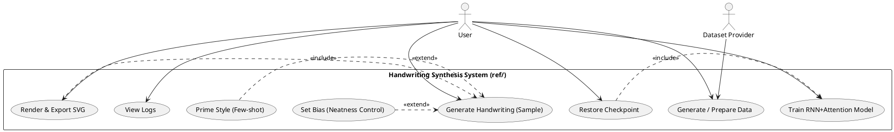

---

## 3.6.3 Entity Relationship Diagram (ERD)

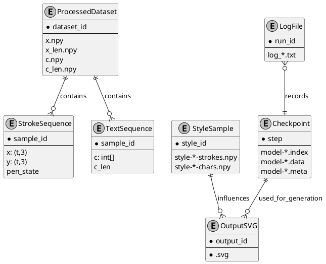

---

## 3.6.4 Class Diagram

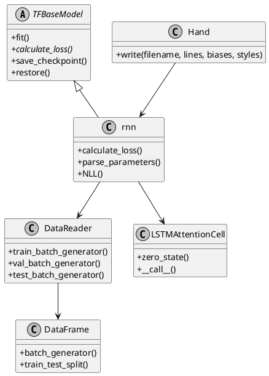

---

## 3.6.5 Object Diagram

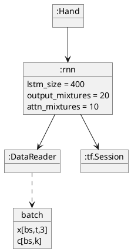

---

## 3.6.6 Activity Diagram

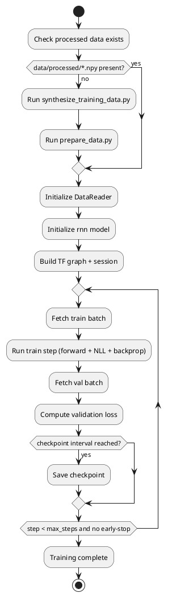

---

## 3.6.7 Sequence Diagram

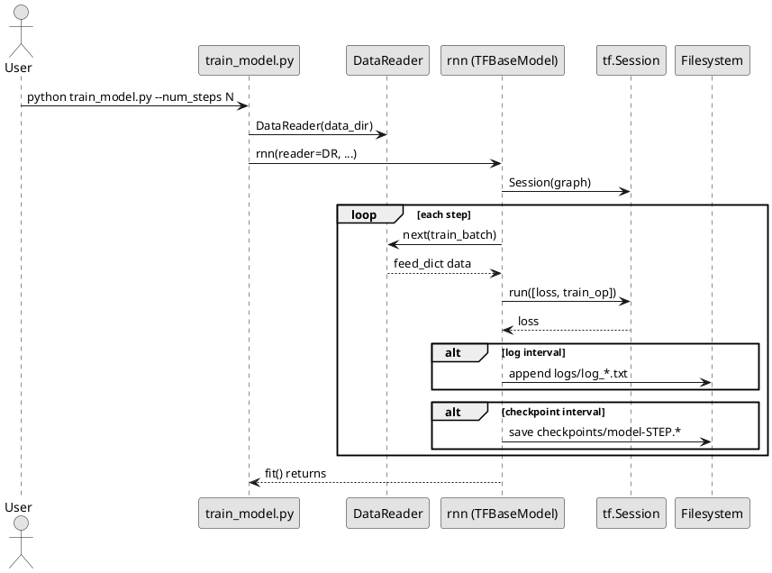

---

## 3.6.8 State-Flow Diagram

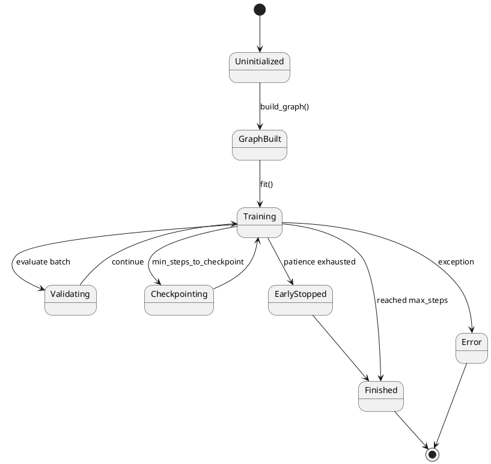

---

## 3.6.9 Context Diagram

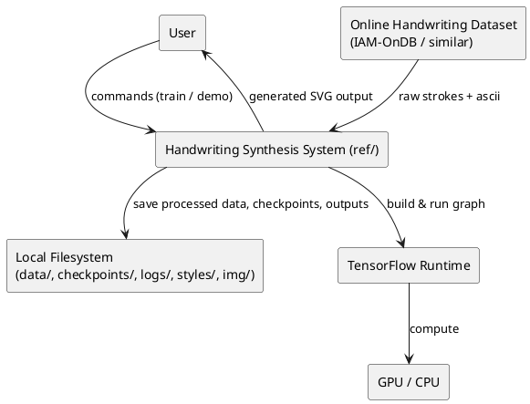

---

## 3.6.10 Data-Flow Diagram (DFD)

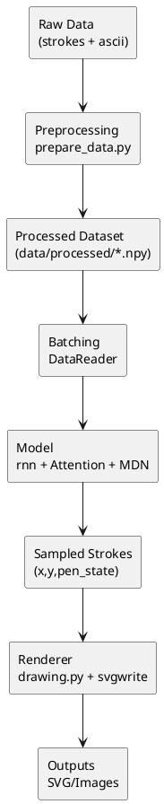

---

## 3.6.11 Component Diagram

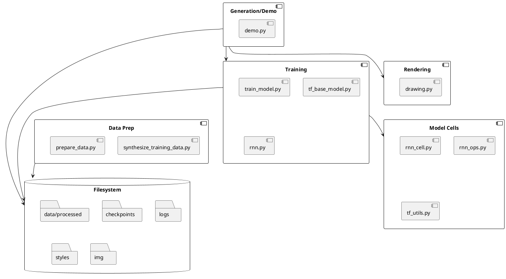

---

## 3.6.12 Package Diagram

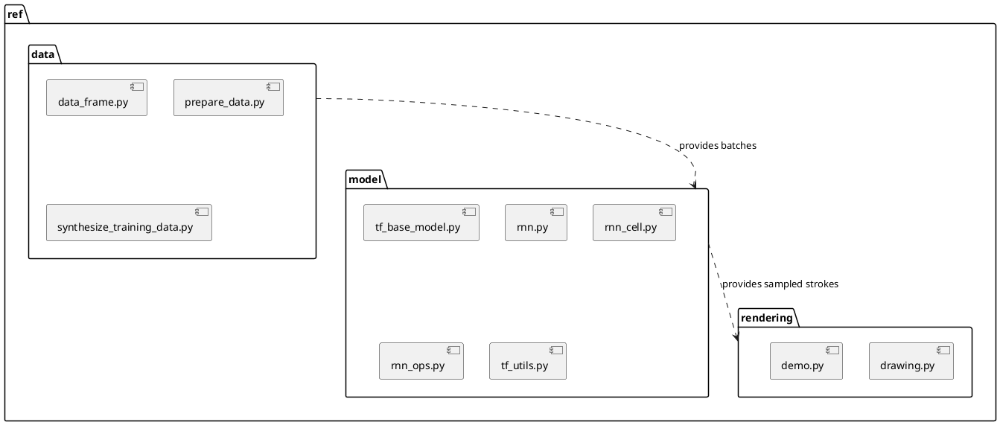

---

## 3.6.13 Deployment Diagram

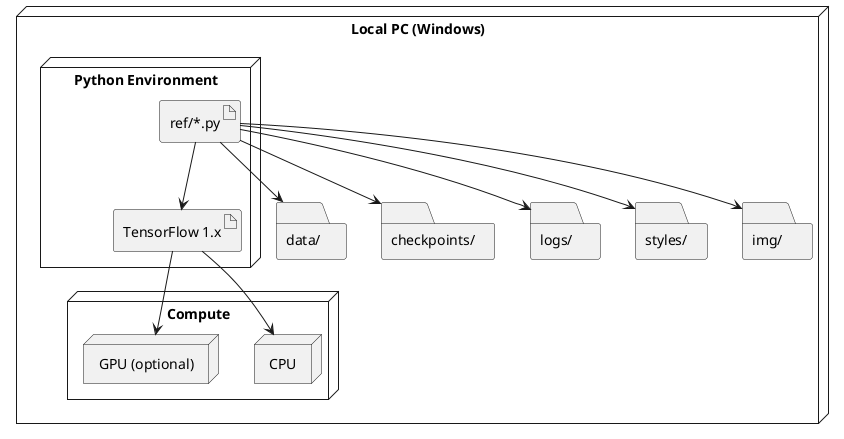
